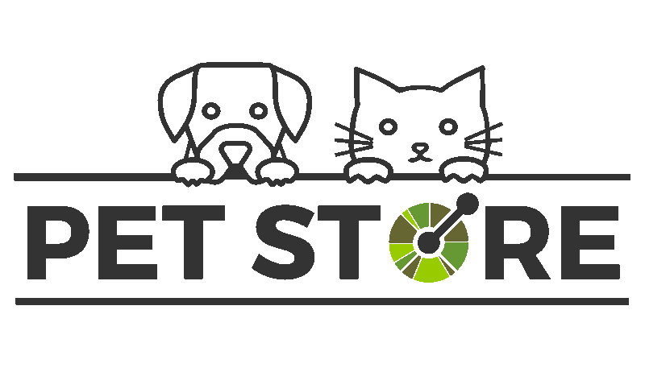

This is a sample server Petstore server.  You can find out more about Swagger at [http://swagger.io](http://swagger.io) or on [irc.freenode.net, #swagger](http://swagger.io/irc/). For this sample, you can use the api key `special-key` to test the authorization filters.

This is an image:

  

  

   

  

  

  

  

  